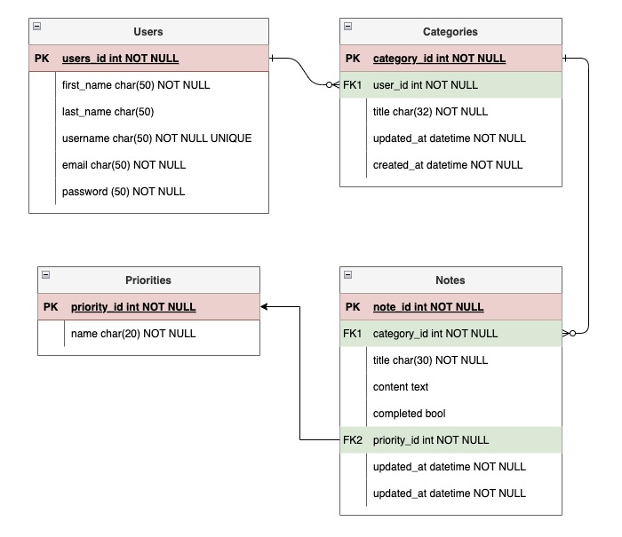

# Notely - Note Management System

Notely is a simple and efficient Note Management System designed to help users create, organize, and manage their notes seamlessly. This README provides an overview of the Notely project, including its features, installation instructions, and usage guidelines.

## Features

- **User Authentication:** Secure your notes with user authentication using JSON Web Tokens (JWT).
- **Create Notes:** Easily create new notes with titles, content, and optional category assignments.
- **Update Notes:** Modify existing notes by updating their titles, content, categories, or completion status.
- **Delete Notes:** Permanently remove unwanted notes, ensuring a clutter-free experience.
- **Categories:** Organize your notes by assigning them to specific categories.
- **List Notes:** Retrieve a list of all notes for the authenticated user with optional filtering by category and completion status.

## Requirements

- **Python:** 3.9 or later
- **Django Rest Framework:** 3.14
- **python-dotenv:** Latest version

## Installation

To set up the Notely project on your local machine, follow these steps:

1. Clone the repository:

   ```bash
   git clone https://github.com/djumanov/notely.git
   cd notely
   ```

2. Create a virtual environment and activate it:

   ```bash
   python -m venv venv
   source venv/bin/activate  # On Windows, use `venv\Scripts\activate`
   ```

3. Install dependencies:

   ```bash
   pip install -r requirements.txt
   ```

4. Configure environment variables:

   Create a `.env` file in the root directory and set the following variables:

   ```env
   SECRET_KEY=your_secret_key
   DEBUG=True
   DATABASE_URL=sqlite:///db.sqlite3
   ```

   Adjust the values accordingly.

5. Apply migrations:

   ```bash
   python manage.py migrate
   ```

6. Start the development server:

   ```bash
   python manage.py runserver
   ```

   The server will run on http://localhost:8000 by default.

## Usage

Before using the Notely API, make sure to obtain a JSON Web Token (JWT) by sending a POST request to `/api/auth/login/` with your username and password. Include the obtained token in the `Authorization` header for all subsequent requests.

Refer to the provided API documentation for detailed information on available endpoints, request formats, and responses.

## API Documentation

Explore the [Notely REST API Documentation](api-docs.md) for comprehensive details on using the API, including authentication, available endpoints, and example requests and responses.

## Database Design


